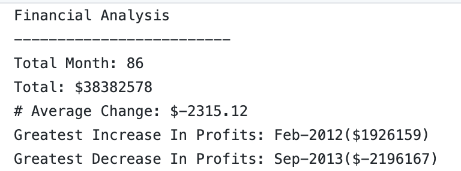
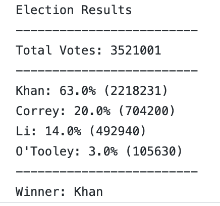

# Py_Me_Up_Charlie

## Technologies Used
- Python
- Jupyter Notebook

## PyBank

### Background
Create a Python script for analyzing the financial records of your company.

## Data
Given a set of financial data called budget_data.csv

### Objective
Create a Python script that analyzes the records to calculate each of the following:
- The total number of months included in the dataset
- The net total amount of "Profit/Losses" over the entire period
- The average of the changes in "Profit/Losses" over the entire period
- The greatest increase in profits (date and amount) over the entire period
- The greatest decrease in losses (date and amount) over the entire period

## PyPoll

### Background
Tasked with helping a small, rural town modernize its vote counting process.

### Data
Given a set of poll data called election_data.csv

### Objective
Create a Python script that analyzes the votes and calculates each of the following:
- The total number of votes cast
- A complete list of candidates who received votes
- The percentage of votes each candidate won
- The total number of votes each candidate won
- The winner of the election based on popular vote.

### Contact:
Alex Arnold: alexnarnold630@gmail.com  
